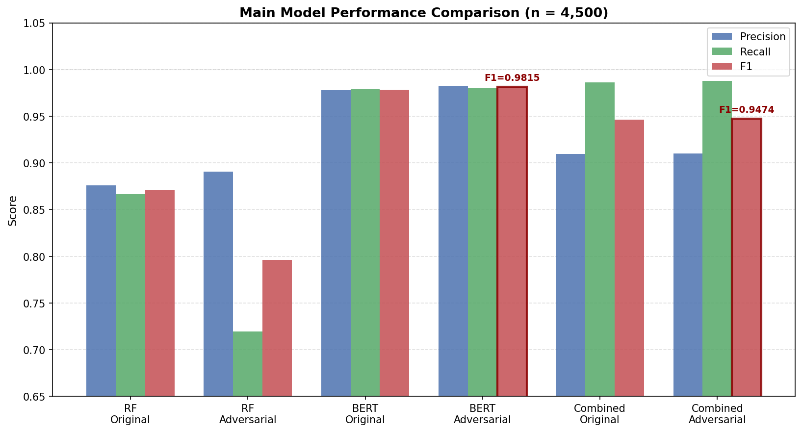
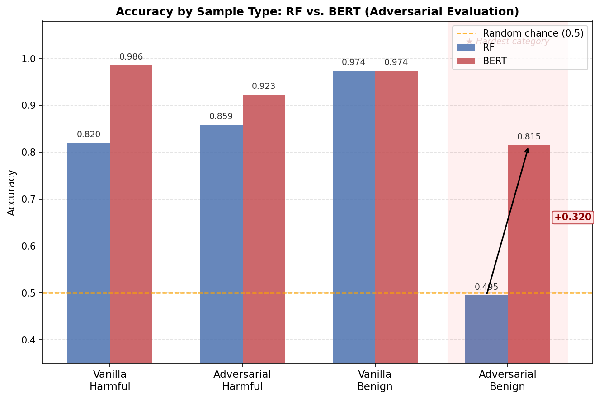

# Inference-Time Jailbreak Defense for LLMs

Lightweight classifier to intercept jailbreak prompts at inference time without modifying the target LLM.

## Results

| Model | F1 |
|---|---|
| LLM-only (LLaMA-8B) | 0.749 |
| RF alone | 0.796 |
| RF + BERT pipeline | 0.947 |
| **BERT alone** | **0.9815** |





## Key Insights

- BERT alone beats the RF+BERT pipeline — RF's false positives on adversarial benign samples cost ~3.4 F1 points
- Cheaper methods (RF, embedding-based, rule-based) all fail on **adversarial benign**: jailbreak-style wording with benign intent
- Adversarial augmentation during training reduced BERT false positives by 22%

## FastAPI Demo

Run API locally:

```bash
uvicorn src.api:app --reload
```

Open:

```text
http://127.0.0.1:8000/docs
```

---

## Docker

Build container:

```bash
docker build -t jailbreak-defense .
```

Run container:

```bash
docker run -p 8000:8000 jailbreak-defense
```
